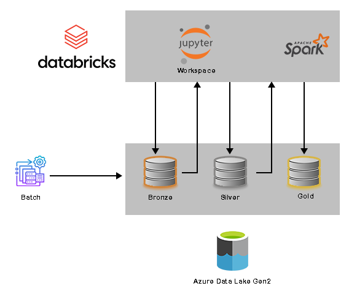
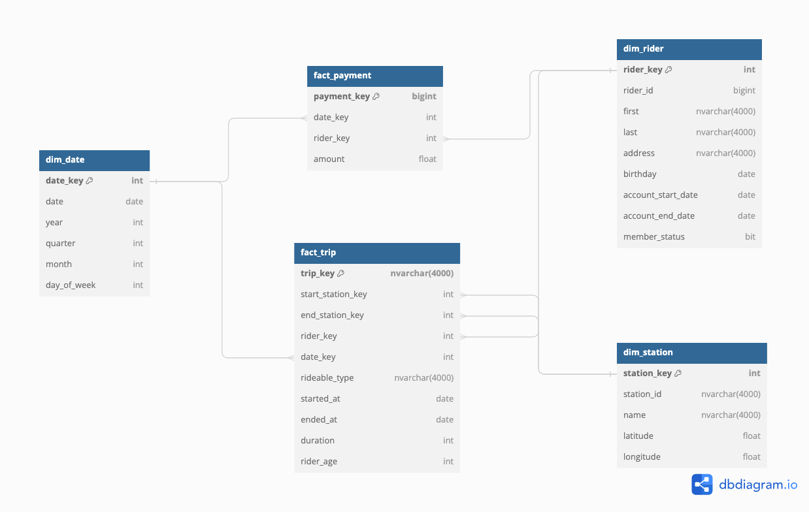
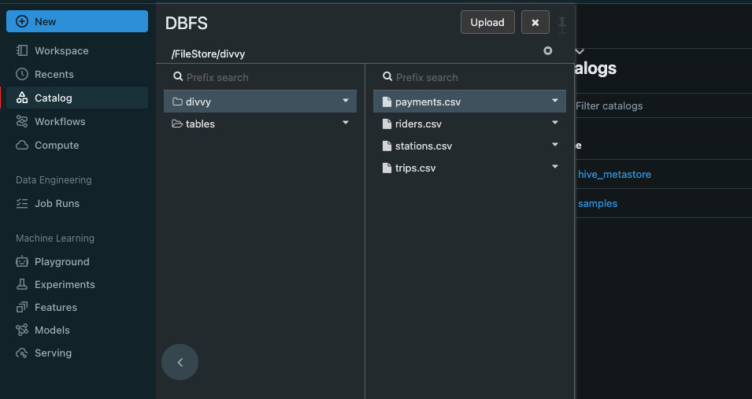
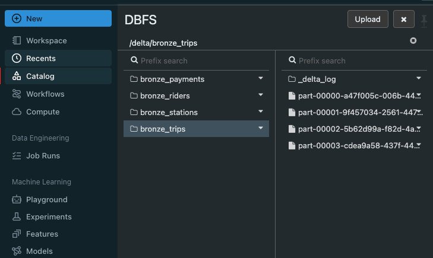
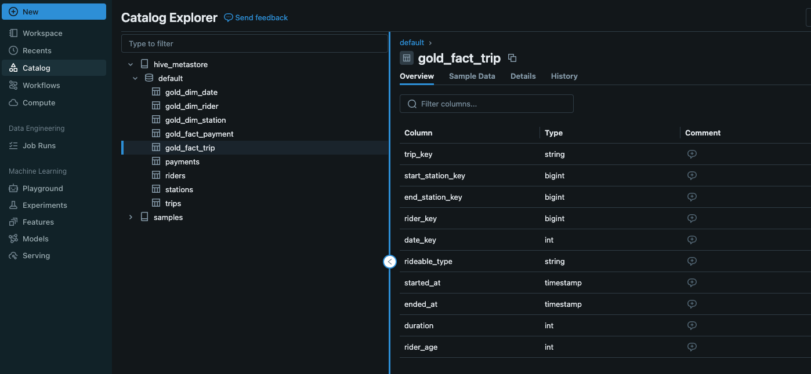

# Divvy Bike Share Analysis

## Overview

Divvy is a bike-sharing program in Chicago, Illinois, USA, where riders can purchase a pass at a kiosk or use a mobile app to unlock bikes at various stations around the city. Riders can then use the bikes for a set period and return them to the same or any other station. The City of Chicago provides anonymized bike trip data to the public, allowing for analysis and projects like this one.

## Project Goals

The goal of this project is to develop a data lake solution using Azure Databricks using a lake house architecture.

- Design a star schema based on the business outcomes listed below
- Import the data into Azure Databricks using Delta Lake to create a Bronze data store
- Create a gold data store in Delta Lake tables
- Transform the data into the star schema for a Gold data store

## Business Outcomes

1. Analyze how much time is spent per ride
    - Based on date and time factors such as day of week and time of day
    - Based on which station is the starting and / or ending station
    - Based on age of the rider at time of the ride
    - Based on whether the rider is a member or a casual rider
2. Analyze how much money is spent
    - Per month, quarter, year
    - Per member, based on the age of the rider at account start
3. Analyze how much money is spent per member
    - Based on how many rides the rider averages per month
    - Based on how many minutes the rider spends on a bike per month

## System Architecture

## Dataset

Since the data from Divvy are anonymous, we have generated fake rider and account profiles along with fake payment data to go along with the data from Divvy.

## Star Schema

## Project Workflow

1. Create Azure Databricks
2. Create Databricks Cluster
3. Import data to DBFS

 

4. Extract data from CSV files stored in Databricks and write it to the Delta file system
`extact_data.ipynb`

 

5. Creates tables and loads data from Delta files into `bronze` layer
`load_data.ipynb`

 

6. Generate the fact and dimension tables and write them into `gold` layer
`transform_data.ipynb`

